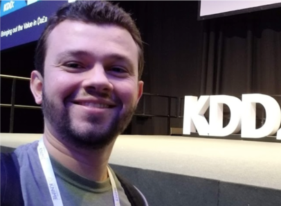

I'm a PhD student on Simon Fraser University (SFU) working on privacy-preserving data mining. My current research focus on deep learning and differential privacy. Before joining SFU, I worked as a Senior Data Scientist for the Brazilian Government for over 6 years and carried out consultancy work for companies and individuals interested in connecting data science to businesses. I also worked for almost a year as Data Science Manager for the Observatory of Public Spending (ODP), leading more than 15 data professionals on projects related to data science, fraud prediction and auditing. <a href="/about">Click here</a> for full biography.

